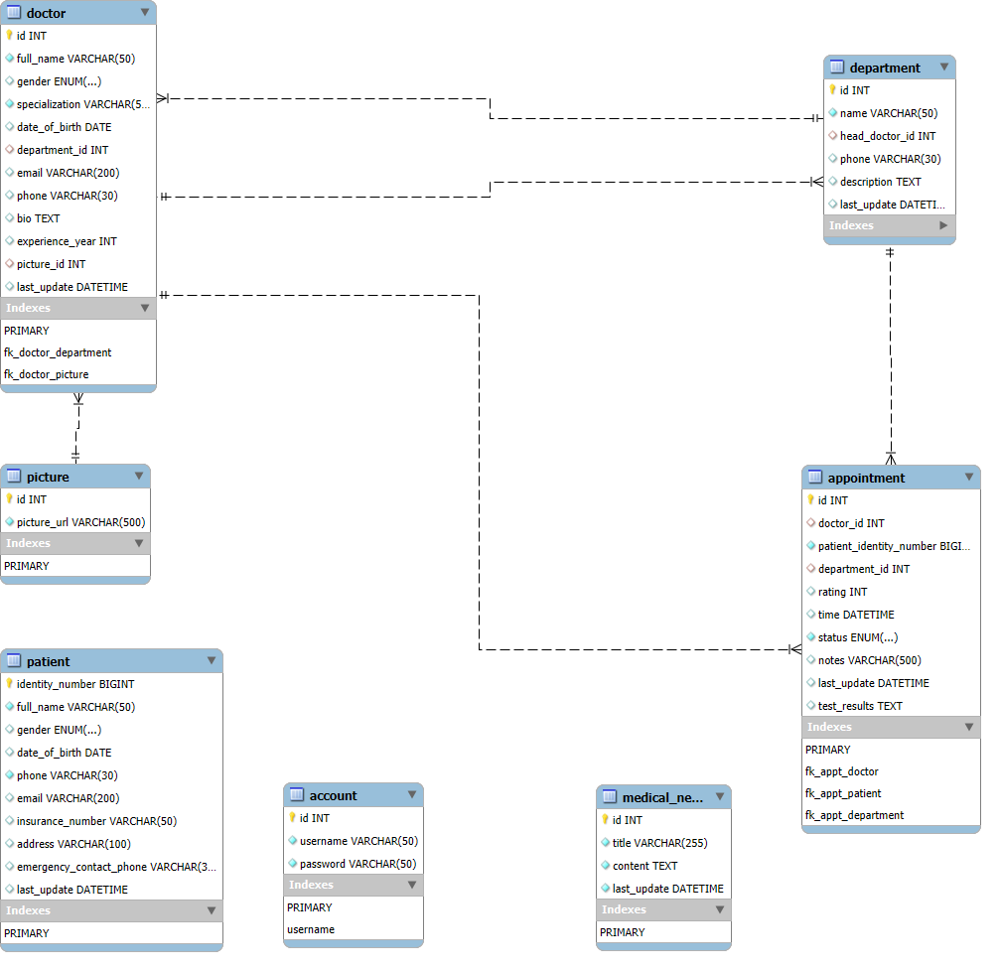

# 🏥 Hệ Thống Quản Lý Bệnh Viện

Dự án **Hệ Thống Quản Lý Bệnh Viện** là một ứng dụng web full-stack được xây dựng để quản lý các hoạt động cốt lõi của một bệnh viện, bao gồm quản lý bệnh nhân, bác sĩ, khoa, và lịch hẹn khám.

Ứng dụng bao gồm một **backend** xây dựng bằng **Spring Boot (Java)** cung cấp các RESTful API và một **frontend** hiện đại được xây dựng với **React + Vite** để tương tác với người dùng một cách mượt mà và hiệu quả.

---

## ✨ Tính Năng Chính

* **Quản lý Bệnh nhân:** Thêm, sửa, xóa, và tìm kiếm thông tin b���nh nhân.
* **Quản lý Bác sĩ:** Thêm, sửa, xóa, và tìm kiếm thông tin bác sĩ.
* **Quản lý Khoa:** Quản lý danh sách các khoa trong bệnh viện.
* **Quản lý Lịch hẹn:** Tạo và quản lý các lịch hẹn khám giữa bác sĩ và bệnh nhân.
* **Quản lý Ca khám:** Thiết lập các ca làm việc cho bác sĩ.
* **Xác thực người dùng:** Đăng nhập/Đăng xuất để thực hiện các thao tác yêu cầu quyền.

---

## 🛠️ Công Nghệ Sử Dụng

### **Backend**

| Thành phần       | Công nghệ                   |
| :--------------- | :-------------------------- |
| ☕ Ngôn ngữ       | **Java 21**                 |
| 🧩 Framework     | **Spring Boot 3.x**         |
| 🗃️ ORM          | Spring Data JPA (Hibernate) |
| 🔐 Bảo mật       | Spring Security, JWT        |
| 🏦 Cơ sở dữ liệu | MySQL 8+                    |
| 🧰 Build Tool    | Maven                       |
| 📄 API Docs      | SpringDoc (OpenAPI/Swagger) |
| 💡 Thư viện      | Lombok, JJWT                |

### **Frontend**

| Thành phần      | Công nghệ                        |
| :-------------- | :------------------------------- |
| 🌐 Ngôn ngữ     | **JavaScript (ES6+)**            |
| ⚛️ Framework    | **React 18+**                    |
| ⚡ Build Tool   | **Vite**                         |
| 🎨 Styling      | CSS Modules / Tailwind CSS       |
| 📞 API Client   | Axios / Fetch API                |
| 📦 State Mgmt   | React Context API / Redux        |
| 🧰 Bundler      | Vite (Fast HMR & Build)          |

---

## 📂 Cấu Trúc Dự Án

```
.
├── assets/
│   └── er_diagram.png           # Sơ đồ ERD
├── backend/
│   └── hospital/                # Source code Spring Boot
├── database/
│   └── back_up_hospital.sql     # File backup CSDL
├── frontend/                    # React + Vite application
│   ├── src/
│   │   ├── components/          # React components
│   │   ├── pages/               # Page components
│   │   ├── services/            # API services
│   │   ├── styles/              # Stylesheets
│   │   ├── App.jsx              # Main App component
│   │   └── main.jsx             # Entry point
│   ├── index.html               # HTML template
│   ├── vite.config.js           # Vite configuration
│   ├── package.json             # Dependencies
│   └── package-lock.json        # Lock file
└── README.md  
```

---

## 🗺️ Sơ Đồ Cơ Sở Dữ Liệu (ERD)

Cấu trúc quan hệ giữa các bảng trong cơ sở dữ liệu được minh họa dưới đây:



---

## 🎥 Video Demo Dự Án

👉 **YouTube Demo:** [https://youtu.be/IYb-c5x6zdE](https://youtu.be/IYb-c5x6zdE)

---

## 🚀 Hướng Dẫn Cài Đặt và Chạy Dự Án

### **Điều kiện tiên quyết**

* **JDK 21** hoặc mới hơn.
* **Maven 3.8** hoặc mới hơn.
* **MySQL 8.0** hoặc mới hơn.
* **Node.js 16+** và **npm 7+** (hoặc yarn/pnpm).
* Một trình duyệt web hiện đại (Chrome, Firefox, Edge).

### **1. Cài Đặt Backend**

#### a. Khởi tạo Cơ sở dữ liệu

1. **Cài đặt và khởi động MySQL Server.**
2. Mở MySQL client (ví dụ: MySQL Workbench, DBeaver).
3. Mở file `database/back_up_hospital.sql` và ấn Execute All.

#### b. Cấu hình Backend

1. Mở file `backend/hospital/src/main/resources/application.properties`.
2. Chỉnh sửa các thông tin kết nối CSDL cho phù hợp với môi trường của bạn:

   ```properties
   spring.datasource.url=jdbc:mysql://localhost:3306/hospital
   spring.datasource.username=root
   spring.datasource.password=your_password_here
   app.upload-dir=your_assets_folder_here
   ```

   > Thay `your_password_here` bằng mật khẩu MySQL của bạn.
   > Thay `your_assets_folder_here` bằng đường dẫn đến folder assets, ví dụ: `file:C:/Users/ADMIN/Desktop/hospital-management/assets`.

#### c. Chạy Backend

1. Mở terminal hoặc Command Prompt, di chuyển vào thư mục `backend/hospital`:

   ```sh
   cd backend/hospital
   ```

2. Sử dụng Maven để build và chạy ứng dụng:

   ```sh
   ./mvnw spring-boot:run
   ```

3. Backend sẽ khởi động và chạy tại địa chỉ `http://localhost:8080`.

### **2. Cài Đặt Frontend**

#### a. Cài đặt Dependencies

1. Mở terminal, di chuyển vào thư mục `frontend`:

   ```sh
   cd frontend
   ```

2. Cài đặt các dependencies bằng npm:

   ```sh
   npm install
   ```

   Hoặc nếu bạn sử dụng yarn:

   ```sh
   yarn install
   ```

#### b. Cấu hình API Endpoint (Nếu cần)

1. Mở file `frontend/src/services/api.js` (hoặc tương tự tùy vào cấu trúc dự án của bạn).
2. Đảm bảo URL của backend API được cấu hình chính xác:

   ```javascript
   const API_BASE_URL = 'http://localhost:8080';
   ```

#### c. Chạy Frontend với Vite

1. Trong thư mục `frontend`, chạy lệnh:

   ```sh
   npm run dev
   ```

   Hoặc với yarn:

   ```sh
   yarn dev
   ```

2. Vite sẽ khởi động development server, thường tại `http://localhost:5173` (hoặc cổng khác nếu 5173 đã được sử dụng).

3. Giao diện quản lý sẽ hiển thị và tự động kết nối đến backend đang chạy ở `http://localhost:8080`.

> **Lưu ý:** Để thực hiện các chức năng thêm, sửa, xóa, bạn cần đăng nhập. Một tài khoản mặc định có thể đã được tạo sẵn trong file backup CSDL.

### **3. Build Frontend cho Production**

Khi sẵn sàng deploy, hãy build ứng dụng React:

```sh
cd frontend
npm run build
```

Thư mục `dist/` sẽ chứa các file tĩnh tối ưu hóa sẵn để deploy.

### **4. Kiểm tra API (Tùy chọn)**

Sau khi backend đã chạy, bạn có thể truy cập vào giao diện Swagger UI để xem danh sách các API và thử nghiệm chúng:

* **URL:** [http://localhost:8080/swagger-ui/index.html](http://localhost:8080/swagger-ui/index.html)

---

## 📝 Ghi Chú Thêm

- **Hot Module Replacement (HMR):** Vite cung cấp HMR nhanh chóng, cho phép bạn thấy thay đổi ngay lập tức khi phát triển.
- **Modern JavaScript:** Frontend sử dụng các tính năng JavaScript hiện đại (ES6+) với React 18.
- **Performance:** Vite tối ưu hóa bundle size và tốc độ load, cải thiện hiệu năng so với webpack cũ.

---

## 📧 Hỗ Trợ

Nếu gặp bất kỳ vấn đề nào, vui lòng liên hệ hoặc mở một issue trên repository này.


