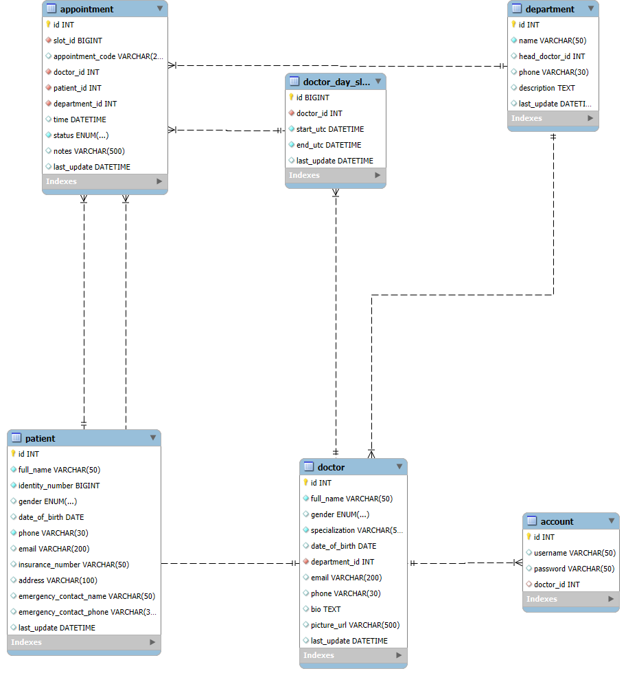

# 🏥 Hospital Management System — Backend

## 📘 Giới thiệu

Dự án **Hospital Management System** là hệ thống quản lý bệnh viện được xây dựng bằng **Spring Boot (Java)** cho backend và **MySQL** làm cơ sở dữ liệu.  
Hệ thống cung cấp các **RESTful API** để quản lý bác sĩ, bệnh nhân, lịch hẹn và các thông tin y tế cơ bản.

> ⚠️ **Lưu ý:** Backend hiện tại mới ở **mức CRUD cơ bản**, chưa triển khai các tính năng nâng cao (authentication, validation, scheduling, v.v.)

---

## ⚙️ Công nghệ sử dụng

| Thành phần | Công nghệ |
|-------------|------------|
| ☕ Ngôn ngữ | Java 21+ |
| 🧩 Framework | Spring Boot 3.x |
| 🗃️ ORM | Spring Data JPA (Hibernate) |
| 🏦 Cơ sở dữ liệu | MySQL 9+ |
| 🧰 Build Tool | Maven |
| 💡 Thư viện tiện ích | Lombok |
| 🌐 API | Spring Web (RESTful) |
| 📦 JSON Parser | Jackson |

---

## 🗺️ Sơ đồ cơ sở dữ liệu (ERD)

Hình dưới minh họa cấu trúc quan hệ giữa các bảng trong cơ sở dữ liệu:

> 📝 Đường dẫn ảnh:  
> `C:\Users\ADMIN\Desktop\lập trình\quản lí bệnh viện OOP - bài giữa kì\assets\er_diagram.png`  
> Khi đẩy lên GitHub, hãy chắc chắn file ảnh nằm trong thư mục `/assets` cùng cấp với `README.md`.

---

## 🚀 Cách chạy dự án

### 1️⃣ Cài đặt MySQL

- Cài đặt MySQL và đảm bảo dịch vụ đang chạy.  
- Mặc định hệ thống sử dụng:
  - **Port:** `3306`
  - **Username:** `root`
  - **Password:** `123456789`

> 🔍 Kiểm tra cổng đang chạy:
> - Mở **MySQL Configurator → Type and Networking → Connectivity Port**

> 🔑 Tạo tài khoản mới:
> - Mở **MySQL Workbench → Home → MySQL Connections → Dấu (+)** để tạo kết nối mới.

---

### 2️⃣ Khởi tạo cơ sở dữ liệu

- Chạy file SQL khởi tạo:
