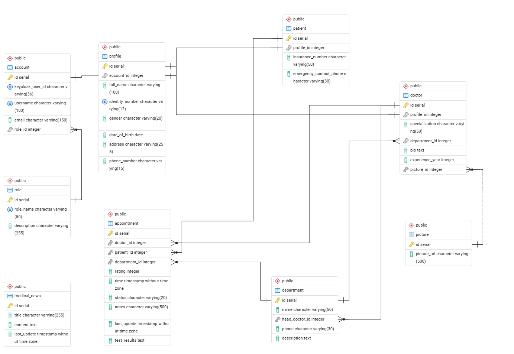

Dưới đây là file `README.md` đã được sắp xếp lại, chỉnh sửa toàn bộ nội dung theo yêu cầu của bạn. Tôi đã giữ nguyên thông tin kỹ thuật, chèn thêm các icon cho các mục **Cơ sở dữ liệu**, **Bảo mật** và **Quản trị vận hành** để văn bản sinh động hơn, đồng thời loại bỏ phần hướng dẫn cài đặt bị lặp lại và trình bày lại phần Luồng hoạt động một cách mạch lạc.

---

# 🏥 Hệ Thống Quản Lý Bệnh Viện

Dự án **Hệ Thống Quản Lý Bệnh Viện** là một ứng dụng web full-stack được xây dựng để quản lý các hoạt động cốt lõi của một bệnh viện, bao gồm quản lý bệnh nhân, bác sĩ, khoa, và lịch hẹn khám.

Ứng dụng bao gồm **backend** xây dựng bằng **Spring Boot (Java)** cung cấp các RESTful API và **frontend** hiện đại được xây dựng với **React + Vite** kết hợp với **Keycloak** giúp hỗ trợ đăng nhập để tương tác với người dùng một cách mượt mà và hiệu quả.

---

## ✨ Tính Năng Chính

*   **Quản lý Bệnh nhân:** Thêm, sửa, xóa, và tìm kiếm thông tin bệnh nhân.
*   **Quản lý Bác sĩ:** Thêm, sửa, xóa, và tìm kiếm thông tin bác sĩ.
*   **Quản lý Khoa:** Quản lý danh sách các khoa trong bệnh viện.
*   **Quản lý Lịch hẹn:** Tạo và quản lý các lịch hẹn khám giữa bác sĩ và bệnh nhân.
*   **Quản lý Ca khám:** Thiết lập các ca làm việc cho bác sĩ.
*   **Xác thực người dùng:** Đăng nhập/Đăng xuất để thực hiện các thao tác yêu cầu quyền.

---

## 🛠️ Công Nghệ Sử Dụng

### 💾 Cơ sở dữ liệu
| Thành phần | Công nghệ |
| :--- | :--- |
| Hệ cơ sở dữ liệu | **PostgreSQL 18.2** |

### 🔒 Bảo mật
| Thành phần | Công nghệ |
| :--- | :--- |
| Identity Management | **Keycloak** |
| Framework | **Spring Security** |

### 🚀 Quản trị vận hành
| Thành phần | Công nghệ |
| :--- | :--- |
| Dockerization | **Docker** |

### ☕ Backend
| Thành phần | Công nghệ |
| :--- | :--- |
| Ngôn ngữ | **Java 21** |
| Framework | **Spring Boot 3.5.7** |
| ORM | Spring Data JPA (Hibernate) |
| Bảo mật | Spring Security, JWT |
| Build Tool | Maven |
| API Docs | SpringDoc (OpenAPI/Swagger) |
| Thư viện | Lombok, JJWT |

### ⚛️ Frontend
| Thành phần | Công nghệ |
| :--- | :--- |
| Ngôn ngữ | **JavaScript (ES6+)** |
| Framework | **React 18+** |
| Build Tool | **Vite** |
| Styling | CSS Modules / Tailwind CSS |
| API Client | Axios / Fetch API |
| State Mgmt | React Context API / Redux |
| Bundler | Vite (Fast HMR & Build) |

---

## 📂 Cấu Trúc Dự Án

```text
.
├── assets/
│   └── er_diagram.png           # Sơ đồ ERD
├── backend/
│   └── hospital/                # Source code Spring Boot
├── database/
│   └── backup.sql               # File backup CSDL
├── frontend/                    # React + Vite application
│   ├── src/
│   │   ├── components/          # React components
│   │   ├── pages/               # Page components
│   │   ├── services/            # API services
│   │   ├── styles/              # Stylesheets
│   │   ├── App.jsx              # Main App component
│   │   └── main.jsx             # Entry point
│   ├── index.html               # HTML template
│   ├── vite.config.js           # Vite configuration
│   ├── package.json             # Dependencies
│   └── package-lock.json        # Lock file
└── README.md  
```

---

## 🗺️ Sơ Đồ Cơ Sở Dữ Liệu (ERD)

Cấu trúc quan hệ giữa các bảng trong cơ sở dữ liệu được minh họa dưới đây:



---

## 🎥 Video Demo Dự Án

👉 **YouTube Demo:** [https://youtu.be/IYb-c5x6zdE](https://youtu.be/IYb-c5x6zdE)

---

## 🚀 Hướng Dẫn Cài Đặt và Chạy Dự Án

Dự án có thể được triển khai theo 2 cách: **Sử dụng Docker Compose** (Khuyến nghị để dễ quản lý Keycloak) hoặc **Chạy Cục Bộ (Local Setup)**.

### Cách 1: Triển khai bằng Docker Compose (Khuyến nghị)
Cách này giúp tự động khởi động PostgreSQL, Keycloak (cổng 8081), Backend và Frontend cùng lúc, giảm thiểu xung đột cấu hình.

#### 1. Chuẩn bị
Đảm bảo máy tính đã cài đặt **Docker** và **Docker Compose**.

#### 2. Khởi động hệ thống
Clone dự án và chạy lệnh:

```bash
git clone https://github.com/ducanh2006/hospital-management
cd hospital-management-main
docker-compose up --build
```
*Lưu ý: Nếu muốn chạy ngầm, thêm cờ `-d`: `docker-compose up -d`.*

#### 3. Truy cập ứng dụng
Hệ thống sẽ khởi động với các cổng sau:
*   **Frontend:** `http://localhost:5173`
*   **Backend API:** `http://localhost:8080`
*   **Keycloak Admin Console:** `http://localhost:8081`
    *   Username mặc định: `admin`
    *   Password mặc định: `admin` (hoặc theo file `.env` nếu có)

> **Lưu ý:** Lần đầu chạy, Keycloak cần thời gian để khởi tạo Realms và Client. Hãy đợi khoảng 30-60 giây trước khi truy cập.

---

### Cách 2: Chạy Cục Bộ (Local Setup)
Cách này yêu cầu cài đặt thủ công từng thành phần. **Ưu tiên dùng Docker cho Keycloak** vì việc cấu hình Keycloak chạy native rất phức tạp.

#### Điều kiện tiên quyết
*   **JDK 21+**, **Maven 3.8+**.
*   **Node.js 16+**, **npm 7+**.
*   **PostgreSQL 8.0+**.
*   **Docker** (Chỉ dùng để chạy Keycloak).

#### Bước 1: Khởi động Keycloak (Bắt buộc qua Docker)
Vì Keycloak nặng và phức tạp, hãy chạy nó trong container thay vì cài đặt trực tiếp.

1.  Tạo một thư mục chứa file `docker-compose.yml` (ví dụ: `keycloak-config`).
2.  Tạo file `docker-compose.yml` với nội dung sau:

```yaml
version: '3'
services:
  keycloak:
    image: quay.io/keycloak/keycloak:latest
    ports:
      - "8081:8080" # Map cổng 8081 ra ngoài
    environment:
      - KEYCLOAK_ADMIN=admin
      - KEYCLOAK_ADMIN_PASSWORD=admin
      - KC_HTTP_PORT=8080
    command: start-dev
    volumes:
      - ./data:/opt/keycloak/data
```

3.  Chạy lệnh:
    ```bash
    docker-compose up -d
    ```
4.  Truy cập `http://localhost:8081` để đăng nhập lần đầu (`admin` / `admin`) và cấu hình Realm/Clients (tạo client ID cho frontend/backend).

#### Bước 2: Cài đặt Cơ sở dữ liệu (PostgreSQL)
1.  Đảm bảo PostgreSQL đang chạy.
2.  Tạo database và import schema:
    ```bash
    createdb hospital_db
    psql -d hospital_db -f database/backup.sql
    ```

#### Bước 3: Cấu hình & Chạy Backend (Spring Boot)
1.  Di chuyển vào thư mục backend:
    ```bash
    cd backend/hospital
    ```
2.  Mở file `src/main/resources/application.properties` và chỉnh sửa:

    ```properties
    # Kết nối CSDL
    spring.datasource.url=jdbc:postgresql://localhost:5432/hospital_db
    spring.datasource.username=your_username_here
    spring.datasource.password=your_password_here
    
    # Cấu hình Keycloak (Thay đổi URL theo môi trường của bạn)
    # Ví dụ: http://localhost:8081/realms/hospital-management
    spring.security.oauth2.resourceserver.jwt.issuer-uri=http://localhost:8081/realms/hospital-management
    spring.security.oauth2.client.registration.keycloak.client-id=hospital-client
    spring.security.oauth2.client.registration.keycloak.client-secret=your_secret_key
    spring.security.oauth2.client.provider.keycloak.authorization-uri=http://localhost:8081/protocol/openid-connect/auth
    spring.security.oauth2.client.provider.keycloak.token-uri=http://localhost:8081/protocol/openid-connect/token
    spring.security.oauth2.client.provider.keycloak.user-info-uri=http://localhost:8081/protocol/openid-connect/userinfo
    spring.security.oauth2.client.provider.keycloak.jwk-set-uri=http://localhost:8081/protocol/openid-connect/certs

    # Đường dẫn lưu ảnh
    app.upload-dir=file:C:/Users/ADMIN/Desktop/hospital-management/assets
    ```
3.  Chạy Backend:
    ```bash
    ./mvnw spring-boot:run
    ```
    > Backend chạy tại: `http://localhost:8080`

#### Bước 4: Cấu hình & Chạy Frontend (React/Vite)
1.  Di chuyển vào thư mục frontend:
    ```bash
    cd frontend
    ```
2.  Cài đặt thư viện:
    ```bash
    npm install
    ```
3.  Cấu hình Keycloak Client (Tùy chọn nhưng khuyến khích):
    *   Nếu dùng thư viện `react-keycloak`, hãy cấu hình `KEYCLOAK_URL=http://localhost:8081` trong file `.env`.
    *   Hoặc kiểm tra file `src/services/api.js` để đảm bảo redirect URI trỏ về đúng cổng frontend (ví dụ: `http://localhost:5173`).
    
    ```javascript
    // Ví dụ trong api.js
    const API_BASE_URL = 'http://localhost:8080';
    ```

4.  Chạy Frontend:
    ```bash
    npm run dev
    ```
    > Frontend chạy tại: `http://localhost:5173`

#### Tổng kết trạng thái hoạt động
Để ứng dụng hoạt động hoàn chỉnh, bạn cần cả 4 dịch vụ chạy đồng thời:
1.  **PostgreSQL**: Cổng 5432 (Chạy local).
2.  **Keycloak**: Cổng 8081 (Chạy qua Docker).
3.  **Backend**: Cổng 8080 (Chạy Spring Boot).
4.  **Frontend**: Cổng 5173 (Chạy Vite).

---

## 🔄 Luồng Hoạt Động Của Dự Án

### 1. Logic Luồng Đăng Nhập & Đồng Bộ Dữ Liệu (Critical)
*   **Auth Provider:** Keycloak (OIDC). Frontend không lưu password, chỉ xử lý Token.
*   **Header Behavior:**
    *   *Chưa login:* Hiển thị nút "Login".
    *   *Đã login:* Hiển thị `full_name` (ghép từ `first_name` + `last_name` trong Keycloak Token). Click vào hiển thị menu: "Edit Profile", "Edit personal information" (thông tin phụ thuộc vào role: Doctor hay Patient), "Logout".
*   **Post-Login Flow (Backend Sync):**
    1.  Frontend nhận Access Token trực tiếp từ Keycloak.
    2.  Khi vừa đăng nhập thành công gọi ngay API: `POST /api/accounts/login` (Header: `Authorization: Bearer <token>`).
    3.  **Backend Logic:**
        *   Giải mã Token, trích xuất thông tin.
        *   **Upsert `account`:** Tạo mới hoặc cập nhật bảng `account`.
        *   **Upsert `profile`:** Tạo mới hoặc cập nhật bảng `profile` liên kết với `account`.
        *   **Sync Roles:** Kiểm tra claim `roles` trong Token:
            *   Có `patient` -> Upsert bảng `patient` (điền null nếu thiếu dữ liệu).
            *   Có `doctor` -> Upsert bảng `doctor` (điền null nếu thiếu dữ liệu).
            *   Mục tiêu: Đảm bảo sự tồn tại của bản ghi nghiệp vụ tương ứng với role.
*   **Logout Flow:** Xóa token local, gọi endpoint logout của Keycloak để invalidate session.

### 2. Logic Chỉnh Sửa Hồ Sơ (Edit Profile)
*   **Access:** Mọi user đã đăng nhập đều sửa được phần `Profile` (thông tin chung).
*   **Conditional Edit:**
    *   Nếu có role `patient`: Cho phép sửa thêm trường thuộc bảng `patient`.
    *   Nếu có role `doctor`: Cho phép sửa thêm trường thuộc bảng `doctor`.
*   **Submission Strategy:**
    *   Frontend gom tất cả thay đổi vào một action "Save".
    *   Gửi đồng thời (parallel) 3 request bằng `Promise.all` tới:
        1.  `PUT /api/profiles`
        2.  `PUT /api/patients` (nếu có role)
        3.  `PUT /api/doctors` (nếu có role)
    *   Payload: Toàn bộ thông tin cập nhật trong Body + Token xác thực.

### 3. Phân Quyền Truy Cập Menu (Navigation)

| Menu Item | Access Control | Ghi chú kỹ thuật |
| :--- | :--- | :--- |
| **Trang chủ, Giới thiệu, Cơ cấu tổ chức** | Public | Không cần Token. |
| **Đội ngũ bác sĩ, Tin tức** | Public | Read-only data. |
| **Đặt lịch khám** | Role: `PATIENT` | Input: `doctor_id`. Backend lấy `patient_id` từ Token. |
| **Kết quả xét nghiệm** | Authenticated | Gọi `appointment-controller`, backend filter theo `patient_id` trong Token. |
| **Quản lý hệ thống** | Role: `ADMIN`, `DOCTOR` | CRUD toàn quyền (Đơn giản hóa: Admin và Doctor có quyền như nhau). |
